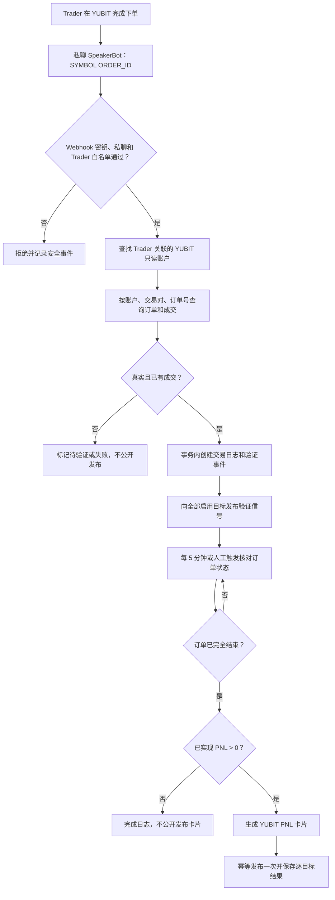

# 多 Trader 交易中心设计规格

**日期：** 2026-07-16

**状态：** 已确认，进入开发

**目标版本：** 交易中心第一期
**产品边界：** SpeakerBot 接收 Trader 提交的真实 YUBIT 订单，完成验单、信号分发、交易日志追踪，并仅在订单盈利平仓后自动发布 PNL 卡片。

## 1. 背景与结论

现有后台已经具备 Telegram 群、Topic、自动发布和广播能力，但缺少面向 Trader 的订单级工作流。第一期新增独立的“交易中心”，不把交易日志混入内容分发中心，也不让 Bot 代替 Trader 下单。

采用以下单一路径：

1. Trader 在自己的 YUBIT 账户或团队共享账户中完成下单。
2. Trader 私聊 SpeakerBot，提交 `交易对 + 订单号`。
3. 后端使用绑定账户的只读 YUBIT API 验证订单及成交记录。
4. 验证成功后建立不可篡改的交易日志，并把信号同步到已配置的群和 Topic。
5. 系统持续核对订单状态；订单完全结束且已实现收益大于零时，自动生成并发布一次 PNL 卡片。
6. 亏损或盈亏为零的订单只保留后台记录，不公开发布 PNL 卡片。

订单号不能脱离账户和交易对单独查询。每个 Trader 必须关联至少一个可查询该订单的 YUBIT 只读账户；多个 Trader 可以共享同一账户，数据模型同时支持未来一名 Trader 关联多个账户。

## 2. 范围

### 2.1 本期包含

- Trader 档案、Telegram 数字用户 ID 白名单和启停状态。
- YUBIT 只读账户的安全绑定、验证、停用和掩码展示。
- SpeakerBot 私聊命令解析、身份校验、订单验证和去重。
- 多 Trader 独立交易日志、订单时间线和状态筛选。
- 按全局或 Trader 维度配置多个 Telegram 目标群和 Topic。
- 验证后的信号一对多发布、逐目标重试和投递记录。
- 订单状态定时核对和人工立即刷新。
- 盈利平仓订单的 YUBIT PNL 卡片生成与一次性发布。
- 后台系统状态、Webhook、YUBIT API、调度器和 Bot 健康检查。
- Neon 数据持久化、Vercel 部署和真实 Telegram 测试 Topic 验收。

### 2.2 本期不包含

- SpeakerBot 或后台自动下单、改单、撤单、转账或提现。
- 使用 Telegram 用户账号登录抓取历史聊天。
- 允许未登记用户通过公开 Bot 查询任意订单。
- 按浮动盈亏生成公开 PNL 卡片。
- 人工输入或修改已实现 PNL 后直接发布。
- 亏损、持平或无法验证订单的公开 PNL 卡片。

## 3. 角色与权限

| 角色 | 能力 | 限制 |
| --- | --- | --- |
| 后台管理员 | 管理 Trader、账户、发布目标、日志、重试和系统状态 | 无法从页面读取完整 API Secret |
| Trader | 私聊 SpeakerBot 提交本人订单、查询状态、请求刷新 | 必须命中 Telegram 数字用户 ID 白名单，只能使用已关联账户 |
| SpeakerBot | 解析命令、验证订单、发布信号和盈利卡片 | 只处理私聊交易命令，不具备交易权限 |
| YUBIT 只读账户 | 查询订单历史、成交明细和已结束 PNL | API Key 必须关闭交易、转账和提现权限 |

生产发布前必须轮换曾经在聊天或日志中暴露过的 Telegram Bot Token，并重新设置 Webhook。任何旧 Token 都不能作为生产可用凭证继续使用。

## 4. 核心工作流



### 4.1 Trader 提交格式

第一期支持以下输入：

```text
BTCUSDT 1234567890
```

允许在后续行补充不参与订单真实性判断的运营信息：

```text
BTCUSDT 1234567890
TP: 69000
SL: 64200
Rationale: Breakout retest with rising volume.
```

也可解析 Trader 转发的 YUBIT 订单通知，但通知中必须同时提取出交易对和订单号。只有订单号或无法识别交易对时，Bot 返回明确的补充格式，不进入公开发布流程。

### 4.2 Bot 命令

- `/start`：说明提交格式、当前 Trader 绑定状态和安全边界。
- `<SYMBOL> <ORDER_ID>`：提交并验证订单。
- `/status <SYMBOL> <ORDER_ID>`：查询本人订单当前追踪状态。
- `/refresh <SYMBOL> <ORDER_ID>`：请求立即核对本人订单。

不提供任何下单、撤单、修改杠杆、转账或提现命令。

### 4.3 订单验证

后端对 Trader 关联账户依次执行只读查询：

1. 通过订单历史确认 `symbol + orderId` 属于该账户。
2. 通过成交明细确认订单至少有一笔真实成交。
3. 保存方向、仓位模式、成交数量、均价、杠杆和交易时间等官方返回字段。
4. 对完全结束的订单，通过已结束 PNL 接口核对已实现收益。

如果 Trader 关联多个账户，系统在服务端逐个查询，但绝不向 Telegram 回复账户密钥或完整账户标识。命中多个账户属于异常，进入待确认状态，不自动发布。

### 4.4 信号发布

只发布 YUBIT API 已验证的事实；Trader 的理由、TP 和 SL 作为明确标注的 Trader 补充信息展示，不伪装成交易所返回值。

信号至少包含：

- Trader 展示名。
- 交易对、Long/Short、杠杆。
- 实际成交均价和数量。
- 提交时间与订单验证状态。
- 可选 TP、SL 和交易理由。
- “Verified by YUBIT”标识。

每个目标单独保存结果。一个目标失败不能阻塞其他目标；管理员可以只重试失败目标。

### 4.5 平仓与 PNL 卡片

- 调度器每 5 分钟扫描仍在追踪的订单。
- 管理员可在后台点击“立即刷新”，Trader 可使用 `/refresh`。
- 只有 YUBIT 返回的已实现 PNL 确认订单完全结束后，才计算最终展示数据。
- `realizedPnl > 0` 时生成卡片；`<= 0` 时只结束日志。
- 卡片展示 Trader、交易对、方向、杠杆、收益率、已实现收益、入场价、结束价和结束时间。
- 每个交易日志最多生成一个 PNL 发布记录；重复 Cron、Webhook 或人工刷新都不能重复发布。

收益率必须由可验证字段计算，并保存计算口径和原始字段快照；无法可靠计算时只展示已实现收益，不伪造 ROI。

## 5. 后台信息架构

新增一级导航“交易中心”，路径 `/trading`，包含四个页签。

### 5.1 交易日志

- 顶部指标：启用 Trader、追踪中订单、待处理异常、已发布 PNL 卡片。
- 筛选：Trader、订单状态、交易对、订单号、时间范围。
- 列表：订单号、Trader、交易对、方向、状态、验证结果、已实现 PNL、更新时间。
- 详情抽屉：订单事实、Trader 补充信息、事件时间线、目标投递、失败原因和重试入口。
- 管理动作：立即刷新、重试失败投递；不得编辑交易所已验证字段。

### 5.2 Trader 管理

- 新增/编辑 Trader 展示名、Telegram 数字用户 ID、用户名备注和启停状态。
- 展示关联 YUBIT 账户和目标规则。
- 数字用户 ID 全局唯一；停用后立即禁止新提交，但保留历史日志。

### 5.3 发布目标

- 支持工作区默认目标和 Trader 专属覆盖目标。
- 使用稳定的 `chatId + threadId` 作为唯一定位，名称仅用于展示。
- 提供权限验证和发送测试消息。
- 同一目标不得被同一信号重复解析为两次投递。

### 5.4 系统状态

- SpeakerBot Webhook 状态和最近更新时间。
- YUBIT 账户验证状态和最近成功查询时间。
- 调度器最近运行、下次运行和失败摘要。
- Neon 数据库状态。
- 目标群发送权限健康状态。
- 不展示 API Secret、完整 API Key、Webhook Secret 或 Bot Token。

界面以 Windows Chrome 1366×768 为基准，同时覆盖键盘操作、表单标签、加载、空状态、错误提示和危险操作二次确认。

## 6. 数据模型

交易域使用独立表，不复用内容分发规则表保存交易事实。

### 6.1 `trade_traders`

- `id`
- `display_name`
- `telegram_user_id`，唯一，使用 Telegram 数字 ID
- `telegram_username`，仅展示
- `status`：`enabled | disabled`
- `created_at`
- `updated_at`

### 6.2 `trade_exchange_accounts`

- `id`
- `exchange`，第一期固定 `yubit`
- `label`
- `credential_ciphertext`
- `credential_iv`
- `credential_auth_tag`
- `key_version`
- `api_key_masked`
- `status`：`pending | verified | invalid | disabled`
- `last_verified_at`
- `last_error_code`
- `created_at`
- `updated_at`

### 6.3 `trade_trader_accounts`

- `trader_id`
- `account_id`
- `is_default`
- `created_at`
- 联合唯一：`trader_id + account_id`

允许多个 Trader 指向同一账户，也允许未来一个 Trader 绑定多个账户。

### 6.4 `trade_signals`

- `id`
- `trader_id`
- `account_id`
- `exchange_order_id`
- `symbol`
- `side`
- `position_idx`
- `leverage`
- `filled_qty`
- `avg_entry_price`
- `avg_exit_price`
- `tp`
- `sl`
- `rationale`
- `status`：`pending_verification | verified | tracking | closed_profit | closed_non_profit | verification_failed | needs_review`
- `verification_payload`
- `verification_error_code`
- `source_chat_id`
- `source_message_id`
- `opened_at`
- `closed_at`
- `realized_pnl`
- `roi`
- `roi_method`
- `created_at`
- `updated_at`
- 唯一：`account_id + symbol + exchange_order_id`

同一共享账户订单如果被多名 Trader 重复提交，第二次提交返回已有记录，不重新归属或再次发布。管理员只能通过带审计记录的纠错流程处理误归属。

### 6.5 `trade_events`

追加写入的订单时间线：

- `id`
- `signal_id`
- `event_type`
- `actor_type`
- `actor_id`
- `payload`
- `telegram_update_id`
- `created_at`

已写入事件不原地修改。

### 6.6 `trade_destinations`

- `id`
- `scope_type`：`workspace | trader`
- `scope_id`，工作区默认时为空，Trader 专属时为 Trader ID
- `chat_id`
- `thread_id`
- `chat_title`
- `topic_title`
- `enabled`
- `last_verified_at`
- `last_error_code`
- `created_at`
- `updated_at`
- 唯一：`scope_type + scope_id + chat_id + thread_id`

Trader 存在专属启用目标时使用专属目标，否则使用工作区默认目标；不合并两组，避免重复和意外扩散。

### 6.7 `trade_deliveries`

- `id`
- `signal_id`
- `publication_type`：`signal | pnl_card`
- `destination_id`
- `status`：`pending | sending | delivered | failed`
- `attempts`
- `telegram_message_id`
- `error_code`
- `error_message_safe`
- `idempotency_key`，唯一
- `created_at`
- `updated_at`

### 6.8 `trade_pnl_publications`

- `id`
- `signal_id`，唯一
- `realized_pnl`
- `roi`
- `card_asset_url`
- `card_payload`
- `status`：`pending | generated | partially_delivered | delivered | failed | skipped`
- `published_at`
- `created_at`
- `updated_at`

### 6.9 `trade_webhook_updates`

- `update_id`，唯一
- `received_at`
- `processing_status`
- `safe_error_code`

用于抵御 Telegram Webhook 重试导致的重复处理。

## 7. 服务与接口

### 7.1 管理接口

- `GET /api/trading`：指标、筛选后的日志和健康摘要。
- `GET|POST|PATCH /api/trading/traders`：Trader 管理。
- `GET|POST|PATCH /api/trading/accounts`：账户绑定、验证和停用；读取接口永不返回 Secret。
- `GET|POST|PATCH /api/trading/destinations`：目标管理、权限验证和测试发送。
- `GET /api/trading/signals/:id`：日志详情和事件时间线。
- `POST /api/trading/signals/:id/refresh`：立即核对订单。
- `POST /api/trading/deliveries/:id/retry`：仅重试失败目标。

以上接口继续使用现有后台登录鉴权，并对修改操作记录管理员审计事件。

### 7.2 SpeakerBot Webhook

- `POST /api/telegram/speaker-webhook`
- 使用独立的 `SPEAKER_TELEGRAM_WEBHOOK_SECRET` 校验 Telegram Secret Token。
- 仅接受 SpeakerBot 更新，不与 ForwardBot Webhook 共用密钥或路径。
- 仅处理私聊中的允许命令。
- 先以 `update_id` 去重，再解析和访问 YUBIT。

### 7.3 订单核对调度

- `POST /api/cron/trading-reconcile`
- 使用 Vercel Cron 与服务端 Cron Secret。
- 每 5 分钟扫描到期的追踪订单。
- 使用数据库事务和租约字段防止同一订单被并发处理。
- YUBIT 暂未返回最终 PNL 时按退避策略重试，不提前判定最终收益。

### 7.4 YUBIT 适配层

封装官方只读能力：

- `perpGetOrderHistory(symbol, orderId)`
- `perpGetExecutions(symbol, orderId)`
- `perpGetClosedPnl(symbol, startTime, endTime)`，再按同账户、交易对、成交数量、方向与时间窗口唯一匹配平仓记录

官方已平仓盈亏接口不接受开仓订单号。适配层必须先由订单历史和成交明细锁定开仓事实，再在同账户、同交易对和受限时间窗口内匹配平仓记录；只有唯一候选才能结算，零个候选继续追踪，多个候选进入待确认。适配层统一处理签名、超时、限流、错误归类和敏感字段脱敏。生产运行时不加载或暴露任何交易、转账、提现动作。

## 8. 安全设计

1. YUBIT API Key/Secret 仅通过已登录后台写入服务端。
2. 凭证使用 AES-256-GCM 加密，主密钥保存在 Vercel 环境变量 `TRADER_CREDENTIALS_ENCRYPTION_KEY`。
3. 数据库只保存密文、IV、认证标签、密钥版本和掩码，不保存明文。
4. 浏览器、Telegram 回复、运行日志、错误信息和 API 响应均不得返回解密后的凭证。
5. SpeakerBot 使用独立 Webhook Secret；ForwardBot 和 SpeakerBot 不共享更新入口。
6. 身份依据 Telegram 数字用户 ID，不依赖可变用户名。
7. 交易命令只接受私聊；群内相同文本不触发订单处理。
8. YUBIT API Key 必须只读，关闭交易、转账和提现权限；系统不设置任何开启交易的运行参数。
9. 所有敏感修改写入审计事件，但审计载荷必须脱敏。
10. 生产发布前轮换全部已暴露 Bot Token，并验证旧 Token 已失效。

## 9. 一致性、去重与失败处理

- Telegram 更新：以 `update_id` 唯一。
- 交易订单：以 `account_id + symbol + exchange_order_id` 唯一。
- 投递：以 `signal_id + publication_type + destination_id` 生成唯一幂等键。
- PNL 发布：以 `signal_id` 唯一。
- 认领订单、写入验证事件和创建目标投递在事务内完成。
- 单目标失败不回滚已成功目标。
- Telegram 429 使用响应中的退避时间重试；超过上限进入失败并提示管理员。
- YUBIT 网络错误、限流和最终 PNL 延迟分别归类，避免把暂时错误误判成订单不存在。
- Topic 删除或权限撤销时目标标记为异常，不自动改投 General Topic。
- 调度器重复触发、人工刷新和 Webhook 并发不能造成重复信号或重复卡片。

## 10. 测试与发布门禁

### 10.1 单元与契约测试

- 命令解析：合法格式、大小写、空格、缺少交易对、缺少订单号、转发消息解析。
- Trader 权限：未授权、停用、用户名变化、数字 ID 匹配。
- 凭证：加解密、错误密钥、轮换版本、API 响应和日志不泄漏。
- YUBIT 适配：订单不存在、未成交、部分成交、完全成交、已平仓、限流、超时和异常载荷。
- 去重：重复 Telegram 更新、重复订单提交、重复 Cron、重复人工刷新。
- 多 Trader：日志隔离、共享账户、多个账户、同一订单重复认领。
- PNL：盈利发布一次，亏损和持平不发布，无法计算 ROI 时不伪造。
- 目标解析：工作区默认、Trader 覆盖、多目标、重复目标消除。

### 10.2 集成测试

- SpeakerBot Webhook 错误密钥、非私聊、非白名单和异常载荷。
- 真实验证成功后向多个目标发送；一个目标失败不影响其他目标。
- 权限撤销、Topic 删除、Telegram 限流和精确重试。
- YUBIT 最终 PNL 延迟时持续追踪，返回后只完成一次。
- 数据库超时和事务冲突不会生成半条日志。
- 页面刷新、重新登录和重新部署后数据仍存在。

### 10.3 UI 测试

- Windows Chrome 1366×768 完整流程。
- 键盘导航、标签、焦点、加载、空状态、错误状态和二次确认。
- 订单号、Telegram ID 和 chatId 等长字段不破坏布局。
- 账户页面只显示掩码，开发者工具响应中也不存在 Secret。

### 10.4 真实环境验收

使用测试 Trader、YUBIT 只读账户和当前两个测试群的指定 Topic：

1. 合法 Trader 提交真实已成交订单后，正常网络下 10 秒内到达全部目标。
2. 未授权用户、群内命令和无效订单不能公开发布。
3. 后台生成完整订单时间线和逐目标投递记录。
4. 订单盈利结束后只发布一张 PNL 卡片，重复刷新无重复。
5. 亏损订单结束后后台可追溯，群内无 PNL 卡片。
6. 刷新、重新登录和重新部署后配置与日志保持一致。
7. 数据库、浏览器响应、Telegram 消息和服务日志中均无明文凭证。

## 11. 发布顺序

1. 新增数据表、加密模块和 YUBIT 只读适配层，先通过自动化测试。
2. 实现 Trader/账户/目标管理接口与交易中心 UI。
3. 实现 SpeakerBot 独立 Webhook 和订单验证日志。
4. 实现信号多目标投递、失败隔离和重试。
5. 实现订单核对 Cron、盈利判断和 PNL 卡片。
6. 部署 Vercel 预览环境，配置测试凭证和测试 Webhook。
7. 在测试 Topic 完成真实链路验收。
8. 轮换生产 Bot Token、备份数据库、配置生产环境变量并发布。
9. 观察至少一个完整订单闭环和一个调度周期，再开放给更多 Trader。

## 12. Owner、产物与完成定义

| Owner | 责任 | 产物 | 完成标准 |
| --- | --- | --- | --- |
| Jobs | 产品流程、状态文案和异常语义 | 交易中心交互说明、Bot 回复文案 | Trader 不需要猜测当前状态或下一步 |
| Musk | 交易中心 UI 与响应式体验 | 四页签页面、筛选、详情、账户掩码和状态组件 | 1366×768 全流程无阻塞，键盘和错误态通过 |
| LeiJun | 数据、鉴权、YUBIT、Webhook、调度和部署 | 数据表、服务、接口、加密、Cron、Vercel 配置 | 只读、安全、幂等，多目标和重部署持久化通过 |
| MaYun | Trader 接入和运营 SOP | Trader 提交格式、目标配置和异常处理 SOP | 新 Trader 可按文档独立完成首次真实提交 |
| Trump | 自动化、真群验收和发布门禁 | 测试报告、失败注入记录、上线检查表 | 所有门禁通过后才允许生产启用 |

本期完成的定义不是“页面可见”，而是一个真实订单从 Trader 私聊提交、YUBIT 验证、群内信号发布、后台持续追踪，到盈利平仓后只发布一次 PNL 卡片的完整闭环；同时未授权用户、无效订单、亏损订单和重复事件都不会造成错误公开发布。

## 13. 风险与依赖

- 依赖 YUBIT 只读 API 的稳定性、签名规则和订单字段完整性。
- 必须由管理员提供专用只读 API Key/Secret；只有订单号无法跨账户验证订单。
- Vercel Cron 的粒度决定平仓识别是分钟级，本期承诺每 5 分钟核对，不承诺亚分钟。
- 部分订单可能分批成交或分批平仓，必须以最终已实现 PNL 为准，不能用当前价格估算。
- Telegram Bot 无法读取 Trader 未主动发送给它的私聊历史。
- 生产上线前必须完成已暴露 Telegram Token 的轮换，否则即使功能通过也不得发布。

为什么现在做：交易信号和 PNL 是高风险、强审计的核心链路，应先建立真实订单验证、权限和不可重复发布能力，再扩展更多 Trader 或自动交易。

为什么本期不做自动下单：它会把只读运营系统升级为资金执行系统，显著扩大凭证权限、风控、合规和故障半径，不属于当前“验证并同步 Trader 已完成订单”的目标。
